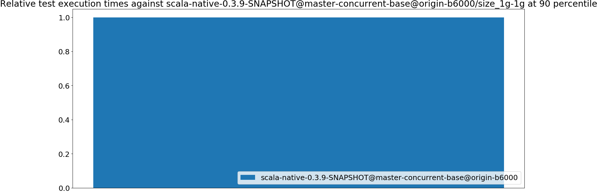
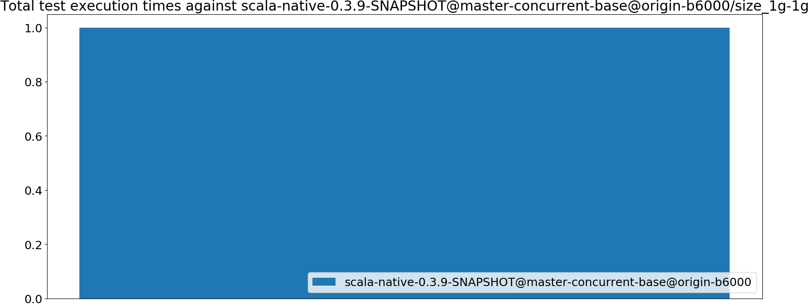
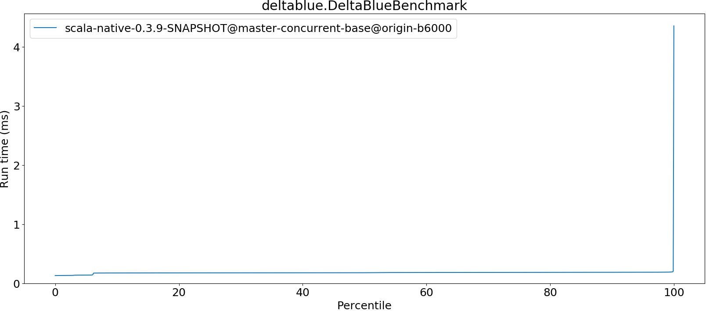
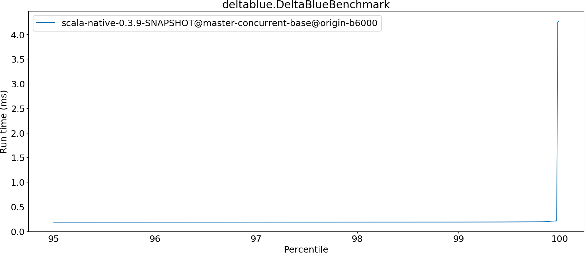
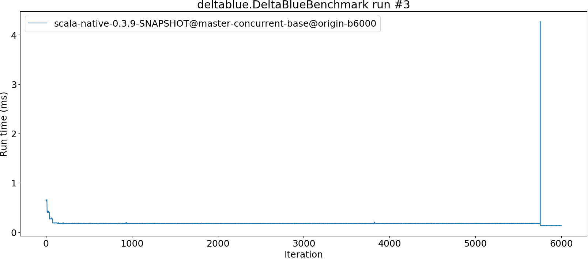
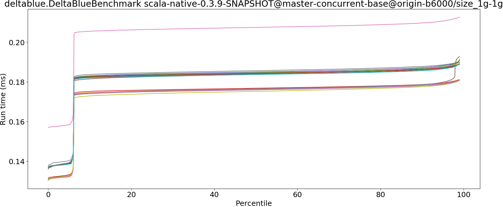
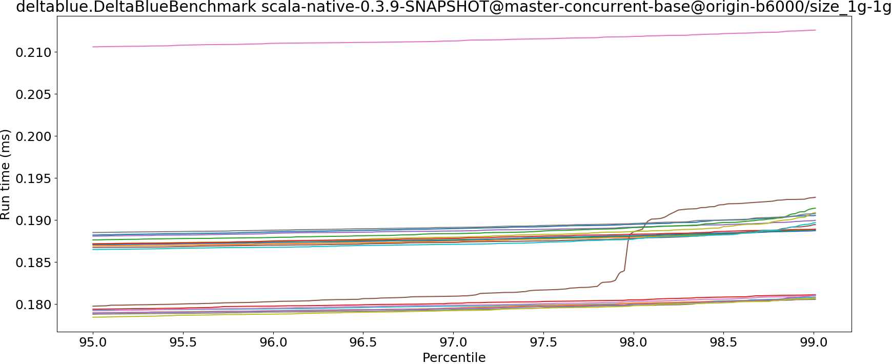

# Summary
## Benchmark run time (ms) at 50 percentile 

|name | scala-native-0.3.9-SNAPSHOT@master-concurrent-base@origin-b6000/size_1g-1g|
| -- | -- |
|[deltablue.DeltaBlueBenchmark](#deltabluedeltabluebenchmark)|0.1789|
| __Geometrical mean:__||
## Benchmark run time (ms) at 90 percentile 

|name | scala-native-0.3.9-SNAPSHOT@master-concurrent-base@origin-b6000/size_1g-1g|
| -- | -- |
|[deltablue.DeltaBlueBenchmark](#deltabluedeltabluebenchmark)|0.1855|
| __Geometrical mean:__||
## Benchmark run time (ms) at 99 percentile 

|name | scala-native-0.3.9-SNAPSHOT@master-concurrent-base@origin-b6000/size_1g-1g|
| -- | -- |
|[deltablue.DeltaBlueBenchmark](#deltabluedeltabluebenchmark)|0.1891|
| __Geometrical mean:__||
## Benchmark run time (ms) at 99.9 percentile 

|name | scala-native-0.3.9-SNAPSHOT@master-concurrent-base@origin-b6000/size_1g-1g|
| -- | -- |
|[deltablue.DeltaBlueBenchmark](#deltabluedeltabluebenchmark)|0.2011|
| __Geometrical mean:__||
## Benchmark total run time (ms) 

|name | scala-native-0.3.9-SNAPSHOT@master-concurrent-base@origin-b6000/size_1g-1g|
| -- | -- |
|[deltablue.DeltaBlueBenchmark](#deltabluedeltabluebenchmark)|11438.7469|
| __Geometrical mean:__||
# Individual benchmarks
## deltablue.DeltaBlueBenchmark

