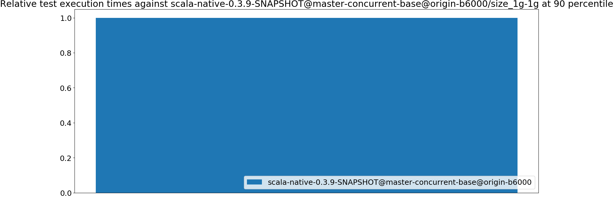
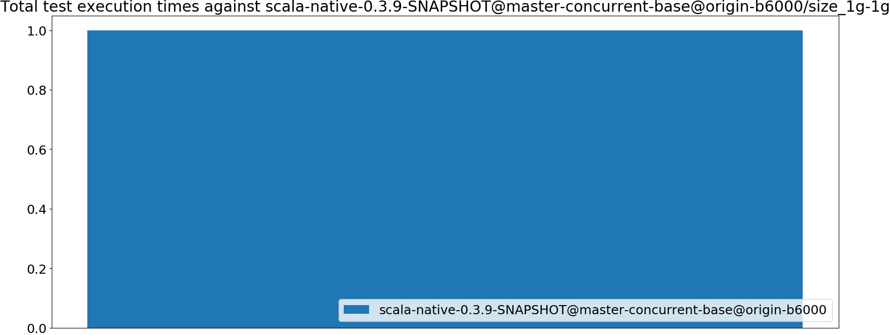
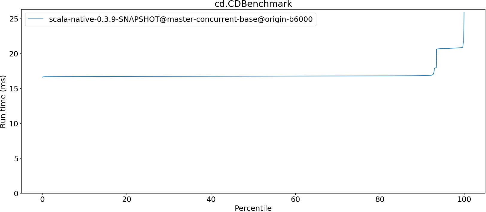
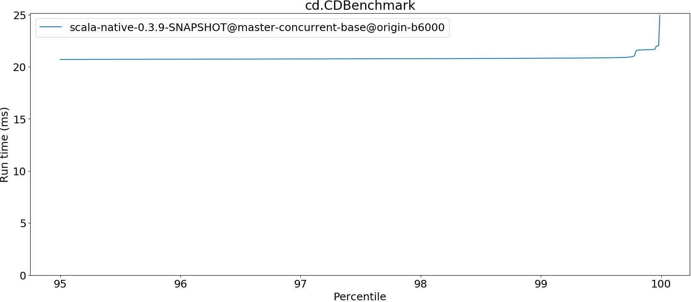
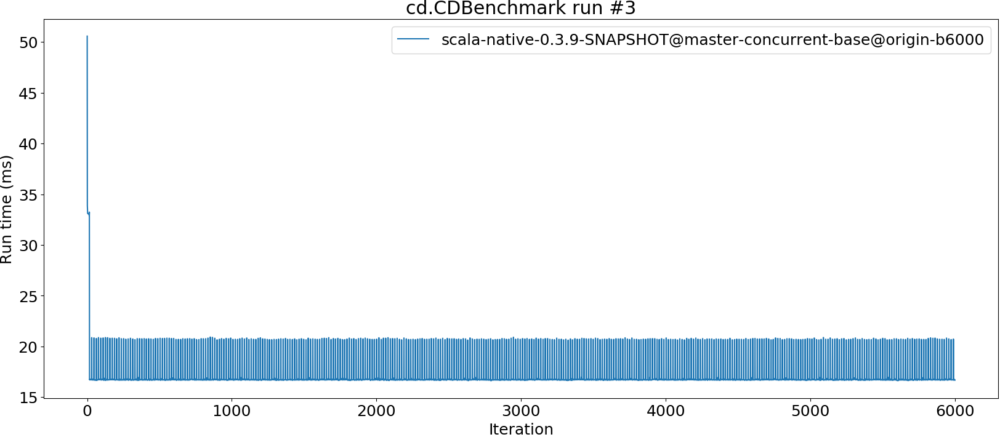
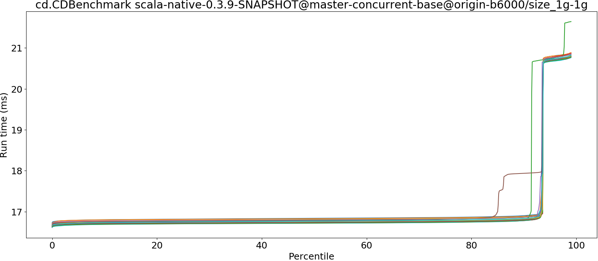
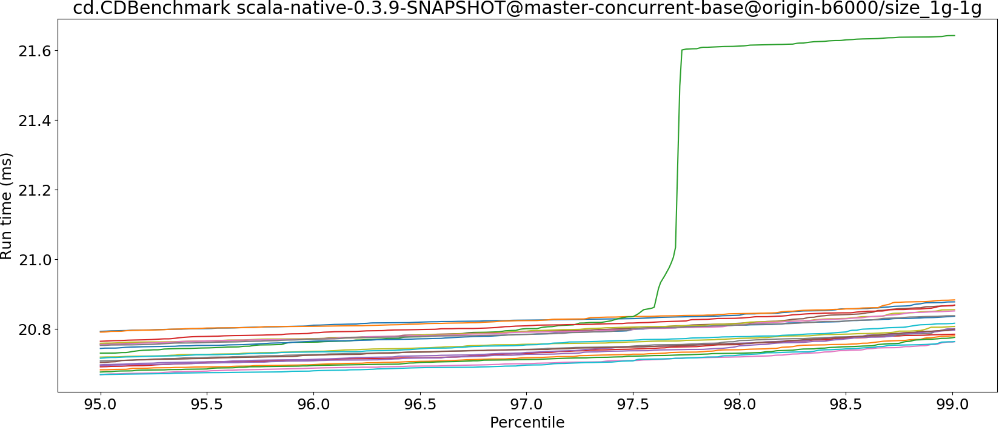

# Summary
## Benchmark run time (ms) at 50 percentile 

|name | scala-native-0.3.9-SNAPSHOT@master-concurrent-base@origin-b6000/size_1g-1g|
| -- | -- |
|[cd.CDBenchmark](#cdcdbenchmark)|16.7477|
| __Geometrical mean:__||
## Benchmark run time (ms) at 90 percentile 

|name | scala-native-0.3.9-SNAPSHOT@master-concurrent-base@origin-b6000/size_1g-1g|
| -- | -- |
|[cd.CDBenchmark](#cdcdbenchmark)|16.8319|
| __Geometrical mean:__||
## Benchmark run time (ms) at 99 percentile 

|name | scala-native-0.3.9-SNAPSHOT@master-concurrent-base@origin-b6000/size_1g-1g|
| -- | -- |
|[cd.CDBenchmark](#cdcdbenchmark)|20.8133|
| __Geometrical mean:__||
## Benchmark run time (ms) at 99.9 percentile 

|name | scala-native-0.3.9-SNAPSHOT@master-concurrent-base@origin-b6000/size_1g-1g|
| -- | -- |
|[cd.CDBenchmark](#cdcdbenchmark)|20.9223|
| __Geometrical mean:__||
## Benchmark total run time (ms) 

|name | scala-native-0.3.9-SNAPSHOT@master-concurrent-base@origin-b6000/size_1g-1g|
| -- | -- |
|[cd.CDBenchmark](#cdcdbenchmark)|1089305.3125|
| __Geometrical mean:__||
# Individual benchmarks
## cd.CDBenchmark

