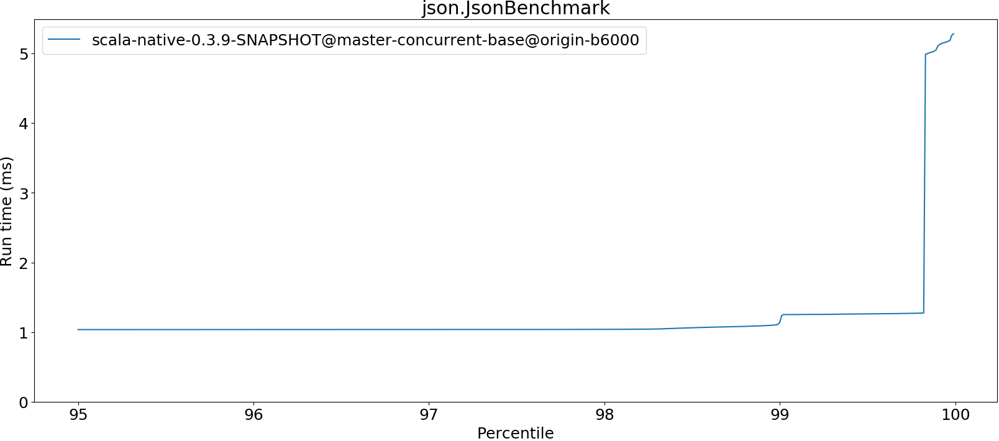

# Summary
## Benchmark run time (ms) at 50 percentile 

|name | scala-native-0.3.9-SNAPSHOT@master-concurrent-base@origin-b6000/size_1g-1g|
| -- | -- |
|[bounce.BounceBenchmark](#bouncebouncebenchmark)|0.0429|
|[brainfuck.BrainfuckBenchmark](#brainfuckbrainfuckbenchmark)|2.3881|
|[cd.CDBenchmark](#cdcdbenchmark)|16.7477|
|[deltablue.DeltaBlueBenchmark](#deltabluedeltabluebenchmark)|0.1789|
|[gcbench.GCBenchBenchmark](#gcbenchgcbenchbenchmark)|66.6025|
|[json.JsonBenchmark](#jsonjsonbenchmark)|1.0293|
|[kmeans.KmeansBenchmark](#kmeanskmeansbenchmark)|36.5372|
|[nbody.NbodyBenchmark](#nbodynbodybenchmark)|25.5770|
|[permute.PermuteBenchmark](#permutepermutebenchmark)|0.1443|
|[queens.QueensBenchmark](#queensqueensbenchmark)|0.0517|
|[richards.RichardsBenchmark](#richardsrichardsbenchmark)|0.0601|
|[sudoku.SudokuBenchmark](#sudokusudokubenchmark)|1.6163|
|[tracer.TracerBenchmark](#tracertracerbenchmark)|0.4882|
| __Geometrical mean:__||
## Benchmark run time (ms) at 90 percentile 

|name | scala-native-0.3.9-SNAPSHOT@master-concurrent-base@origin-b6000/size_1g-1g|
| -- | -- |
|[bounce.BounceBenchmark](#bouncebouncebenchmark)|0.0439|
|[brainfuck.BrainfuckBenchmark](#brainfuckbrainfuckbenchmark)|2.4235|
|[cd.CDBenchmark](#cdcdbenchmark)|16.8319|
|[deltablue.DeltaBlueBenchmark](#deltabluedeltabluebenchmark)|0.1855|
|[gcbench.GCBenchBenchmark](#gcbenchgcbenchbenchmark)|67.5611|
|[json.JsonBenchmark](#jsonjsonbenchmark)|1.0342|
|[kmeans.KmeansBenchmark](#kmeanskmeansbenchmark)|36.8992|
|[nbody.NbodyBenchmark](#nbodynbodybenchmark)|25.9745|
|[permute.PermuteBenchmark](#permutepermutebenchmark)|0.2088|
|[queens.QueensBenchmark](#queensqueensbenchmark)|0.0536|
|[richards.RichardsBenchmark](#richardsrichardsbenchmark)|0.0626|
|[sudoku.SudokuBenchmark](#sudokusudokubenchmark)|1.6292|
|[tracer.TracerBenchmark](#tracertracerbenchmark)|0.4943|
| __Geometrical mean:__||
## Benchmark run time (ms) at 99 percentile 

|name | scala-native-0.3.9-SNAPSHOT@master-concurrent-base@origin-b6000/size_1g-1g|
| -- | -- |
|[bounce.BounceBenchmark](#bouncebouncebenchmark)|0.0454|
|[brainfuck.BrainfuckBenchmark](#brainfuckbrainfuckbenchmark)|2.4647|
|[cd.CDBenchmark](#cdcdbenchmark)|20.8133|
|[deltablue.DeltaBlueBenchmark](#deltabluedeltabluebenchmark)|0.1891|
|[gcbench.GCBenchBenchmark](#gcbenchgcbenchbenchmark)|68.7063|
|[json.JsonBenchmark](#jsonjsonbenchmark)|1.0569|
|[kmeans.KmeansBenchmark](#kmeanskmeansbenchmark)|41.8637|
|[nbody.NbodyBenchmark](#nbodynbodybenchmark)|27.4756|
|[permute.PermuteBenchmark](#permutepermutebenchmark)|0.2120|
|[queens.QueensBenchmark](#queensqueensbenchmark)|0.0552|
|[richards.RichardsBenchmark](#richardsrichardsbenchmark)|0.0657|
|[sudoku.SudokuBenchmark](#sudokusudokubenchmark)|1.6459|
|[tracer.TracerBenchmark](#tracertracerbenchmark)|0.5016|
| __Geometrical mean:__||
## Benchmark run time (ms) at 99.9 percentile 

|name | scala-native-0.3.9-SNAPSHOT@master-concurrent-base@origin-b6000/size_1g-1g|
| -- | -- |
|[bounce.BounceBenchmark](#bouncebouncebenchmark)|0.0466|
|[brainfuck.BrainfuckBenchmark](#brainfuckbrainfuckbenchmark)|6.6690|
|[cd.CDBenchmark](#cdcdbenchmark)|20.9223|
|[deltablue.DeltaBlueBenchmark](#deltabluedeltabluebenchmark)|0.2011|
|[gcbench.GCBenchBenchmark](#gcbenchgcbenchbenchmark)|78.9134|
|[json.JsonBenchmark](#jsonjsonbenchmark)|5.1029|
|[kmeans.KmeansBenchmark](#kmeanskmeansbenchmark)|42.9483|
|[nbody.NbodyBenchmark](#nbodynbodybenchmark)|29.8739|
|[permute.PermuteBenchmark](#permutepermutebenchmark)|0.2185|
|[queens.QueensBenchmark](#queensqueensbenchmark)|0.0566|
|[richards.RichardsBenchmark](#richardsrichardsbenchmark)|0.0692|
|[sudoku.SudokuBenchmark](#sudokusudokubenchmark)|5.7533|
|[tracer.TracerBenchmark](#tracertracerbenchmark)|4.4334|
| __Geometrical mean:__||
## Benchmark total run time (ms) 

|name | scala-native-0.3.9-SNAPSHOT@master-concurrent-base@origin-b6000/size_1g-1g|
| -- | -- |
|[bounce.BounceBenchmark](#bouncebouncebenchmark)|2740.1680|
|[brainfuck.BrainfuckBenchmark](#brainfuckbrainfuckbenchmark)|154213.3345|
|[cd.CDBenchmark](#cdcdbenchmark)|1089305.3125|
|[deltablue.DeltaBlueBenchmark](#deltabluedeltabluebenchmark)|11438.7469|
|[gcbench.GCBenchBenchmark](#gcbenchgcbenchbenchmark)|4038880.4510|
|[json.JsonBenchmark](#jsonjsonbenchmark)|66509.9465|
|[kmeans.KmeansBenchmark](#kmeanskmeansbenchmark)|2350643.2520|
|[nbody.NbodyBenchmark](#nbodynbodybenchmark)|1645725.2247|
|[permute.PermuteBenchmark](#permutepermutebenchmark)|10848.1379|
|[queens.QueensBenchmark](#queensqueensbenchmark)|3330.0961|
|[richards.RichardsBenchmark](#richardsrichardsbenchmark)|3874.2968|
|[sudoku.SudokuBenchmark](#sudokusudokubenchmark)|103861.3359|
|[tracer.TracerBenchmark](#tracertracerbenchmark)|31965.3197|
| __Geometrical mean:__||
# Individual benchmarks
## bounce.BounceBenchmark

## brainfuck.BrainfuckBenchmark

## cd.CDBenchmark

## deltablue.DeltaBlueBenchmark

## gcbench.GCBenchBenchmark

## json.JsonBenchmark

## kmeans.KmeansBenchmark

## nbody.NbodyBenchmark

## permute.PermuteBenchmark

## queens.QueensBenchmark

## richards.RichardsBenchmark

## sudoku.SudokuBenchmark

## tracer.TracerBenchmark

