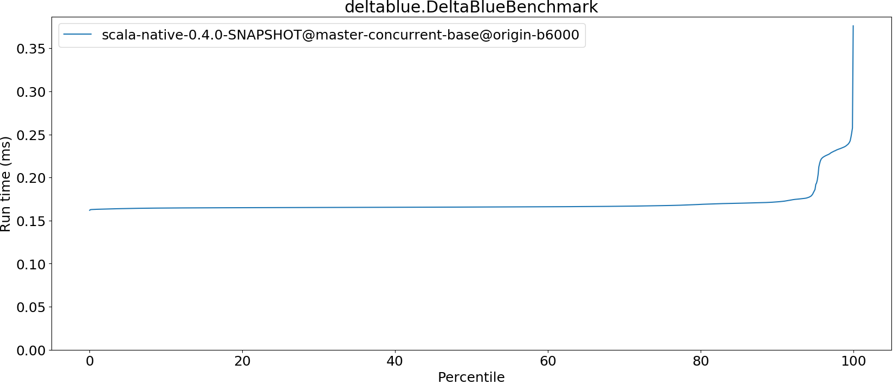

# Summary
## Benchmark run time (ms) at 50 percentile 

|name | scala-native-0.4.0-SNAPSHOT@master-concurrent-base@origin-b6000|
| -- | -- |
|[deltablue.DeltaBlueBenchmark](#deltabluedeltabluebenchmark)|0.1657|
| __Geometrical mean:__||
## Benchmark run time (ms) at 90 percentile 

|name | scala-native-0.4.0-SNAPSHOT@master-concurrent-base@origin-b6000|
| -- | -- |
|[deltablue.DeltaBlueBenchmark](#deltabluedeltabluebenchmark)|0.1714|
| __Geometrical mean:__||
## Benchmark run time (ms) at 99 percentile 

|name | scala-native-0.4.0-SNAPSHOT@master-concurrent-base@origin-b6000|
| -- | -- |
|[deltablue.DeltaBlueBenchmark](#deltabluedeltabluebenchmark)|0.2353|
| __Geometrical mean:__||
## Benchmark run time (ms) at 99.9 percentile 

|name | scala-native-0.4.0-SNAPSHOT@master-concurrent-base@origin-b6000|
| -- | -- |
|[deltablue.DeltaBlueBenchmark](#deltabluedeltabluebenchmark)|0.2573|
| __Geometrical mean:__||
## Benchmark total run time (ms) 

|name | scala-native-0.4.0-SNAPSHOT@master-concurrent-base@origin-b6000|
| -- | -- |
|[deltablue.DeltaBlueBenchmark](#deltabluedeltabluebenchmark)|10857.4922|
| __Geometrical mean:__||
# Individual benchmarks
## deltablue.DeltaBlueBenchmark

