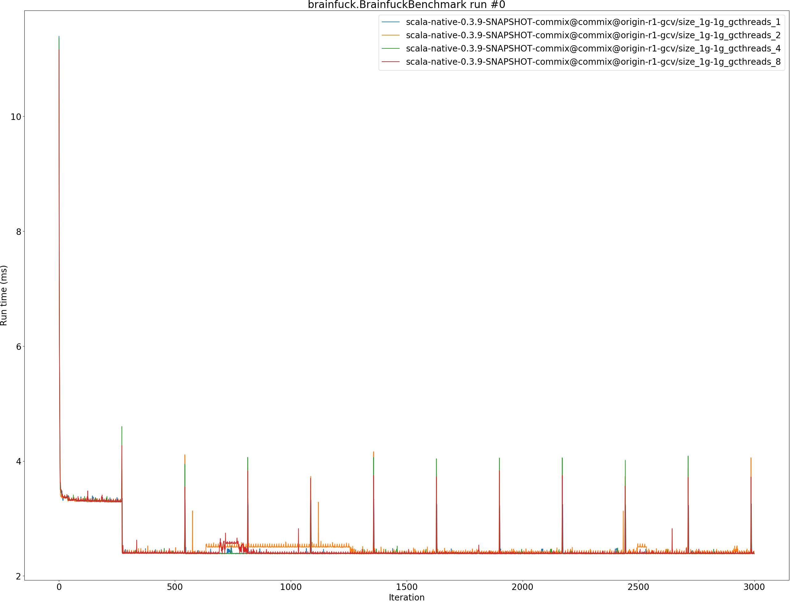
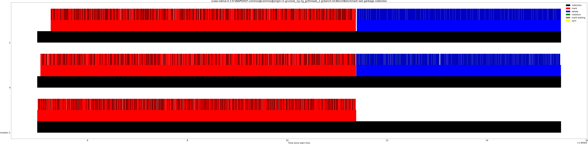
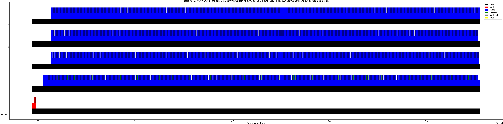

# Summary
## Benchmark run time (ms) at 50 percentile 

|name | scala-native-0.3.9-SNAPSHOT-commix@commix@origin-r1-gcv/size_1g-1g_gcthreads_1 | scala-native-0.3.9-SNAPSHOT-commix@commix@origin-r1-gcv/size_1g-1g_gcthreads_2 |  | scala-native-0.3.9-SNAPSHOT-commix@commix@origin-r1-gcv/size_1g-1g_gcthreads_4 |  | scala-native-0.3.9-SNAPSHOT-commix@commix@origin-r1-gcv/size_1g-1g_gcthreads_8 | |
| -- | -- | -- | -- | -- | -- | -- | -- |
|[brainfuck.BrainfuckBenchmark](#brainfuckbrainfuckbenchmark)|2.3931|2.3896|__-0.15%__|2.3898|__-0.14%__|2.3905|__-0.11%__|
|[cd.CDBenchmark](#cdcdbenchmark)|16.9905|16.4170|__-3.38%__|16.9591|__-0.18%__|16.3357|__-3.85%__|
|[gcbench.GCBenchBenchmark](#gcbenchgcbenchbenchmark)|63.5540|65.8933|+3.68%|60.7681|__-4.38%__|62.0424|__-2.38%__|
|[json.JsonBenchmark](#jsonjsonbenchmark)|0.9364|0.9352|__-0.13%__|0.9341|__-0.25%__|0.8968|__-4.24%__|
|[kmeans.KmeansBenchmark](#kmeanskmeansbenchmark)|36.2995|36.1598|__-0.38%__|36.2302|__-0.19%__|36.5043|+0.56%|
|[nbody.NbodyBenchmark](#nbodynbodybenchmark)|25.5394|25.5376|__-0.01%__|24.4039|__-4.45%__|25.5389|__-0.00%__|
|[sudoku.SudokuBenchmark](#sudokusudokubenchmark)|1.5282|1.5211|__-0.46%__|1.5401|+0.78%|1.6022|+4.84%|
|[tracer.TracerBenchmark](#tracertracerbenchmark)|0.4956|0.4908|__-0.96%__|0.4771|__-3.72%__|0.4885|__-1.43%__|
| __Geometrical mean:__|| |__-0.24%__| |__-1.59%__| |__-0.86%__|
## Benchmark run time (ms) at 90 percentile 

|name | scala-native-0.3.9-SNAPSHOT-commix@commix@origin-r1-gcv/size_1g-1g_gcthreads_1 | scala-native-0.3.9-SNAPSHOT-commix@commix@origin-r1-gcv/size_1g-1g_gcthreads_2 |  | scala-native-0.3.9-SNAPSHOT-commix@commix@origin-r1-gcv/size_1g-1g_gcthreads_4 |  | scala-native-0.3.9-SNAPSHOT-commix@commix@origin-r1-gcv/size_1g-1g_gcthreads_8 | |
| -- | -- | -- | -- | -- | -- | -- | -- |
|[brainfuck.BrainfuckBenchmark](#brainfuckbrainfuckbenchmark)|2.3979|2.4441|+1.93%|2.3960|__-0.08%__|2.4199|+0.92%|
|[cd.CDBenchmark](#cdcdbenchmark)|17.0740|16.5133|__-3.28%__|17.0506|__-0.14%__|16.4540|__-3.63%__|
|[gcbench.GCBenchBenchmark](#gcbenchgcbenchbenchmark)|66.9961|69.0491|+3.06%|64.1611|__-4.23%__|63.2476|__-5.60%__|
|[json.JsonBenchmark](#jsonjsonbenchmark)|0.9414|0.9401|__-0.14%__|0.9393|__-0.23%__|0.9019|__-4.20%__|
|[kmeans.KmeansBenchmark](#kmeanskmeansbenchmark)|36.6192|36.4850|__-0.37%__|38.8902|+6.20%|51.2261|+39.89%|
|[nbody.NbodyBenchmark](#nbodynbodybenchmark)|26.1419|25.9190|__-0.85%__|24.8233|__-5.04%__|26.0061|__-0.52%__|
|[sudoku.SudokuBenchmark](#sudokusudokubenchmark)|1.5520|1.5335|__-1.19%__|1.5643|+0.79%|1.6246|+4.68%|
|[tracer.TracerBenchmark](#tracertracerbenchmark)|0.5019|0.4964|__-1.09%__|0.4827|__-3.82%__|0.4932|__-1.74%__|
| __Geometrical mean:__|| |__-0.26%__| |__-0.87%__| |+2.92%|
## Benchmark run time (ms) at 99 percentile 

|name | scala-native-0.3.9-SNAPSHOT-commix@commix@origin-r1-gcv/size_1g-1g_gcthreads_1 | scala-native-0.3.9-SNAPSHOT-commix@commix@origin-r1-gcv/size_1g-1g_gcthreads_2 |  | scala-native-0.3.9-SNAPSHOT-commix@commix@origin-r1-gcv/size_1g-1g_gcthreads_4 |  | scala-native-0.3.9-SNAPSHOT-commix@commix@origin-r1-gcv/size_1g-1g_gcthreads_8 | |
| -- | -- | -- | -- | -- | -- | -- | -- |
|[brainfuck.BrainfuckBenchmark](#brainfuckbrainfuckbenchmark)|2.8548|2.5599|__-10.33%__|2.4652|__-13.65%__|2.4576|__-13.91%__|
|[cd.CDBenchmark](#cdcdbenchmark)|19.2582|18.6004|__-3.42%__|18.8267|__-2.24%__|17.8637|__-7.24%__|
|[gcbench.GCBenchBenchmark](#gcbenchgcbenchbenchmark)|67.3854|77.5188|+15.04%|64.4470|__-4.36%__|71.8340|+6.60%|
|[json.JsonBenchmark](#jsonjsonbenchmark)|1.2407|0.9812|__-20.91%__|0.9413|__-24.13%__|0.9093|__-26.71%__|
|[kmeans.KmeansBenchmark](#kmeanskmeansbenchmark)|39.4631|38.5036|__-2.43%__|51.4933|+30.48%|51.8040|+31.27%|
|[nbody.NbodyBenchmark](#nbodynbodybenchmark)|36.1581|27.0322|__-25.24%__|25.6980|__-28.93%__|36.1227|__-0.10%__|
|[sudoku.SudokuBenchmark](#sudokusudokubenchmark)|1.5802|1.5507|__-1.87%__|1.5723|__-0.50%__|1.6482|+4.30%|
|[tracer.TracerBenchmark](#tracertracerbenchmark)|0.5393|0.5327|__-1.23%__|0.5504|+2.06%|0.5349|__-0.82%__|
| __Geometrical mean:__|| |__-7.05%__| |__-6.65%__| |__-2.06%__|
## Benchmark run time (ms) at 99.9 percentile 

|name | scala-native-0.3.9-SNAPSHOT-commix@commix@origin-r1-gcv/size_1g-1g_gcthreads_1 | scala-native-0.3.9-SNAPSHOT-commix@commix@origin-r1-gcv/size_1g-1g_gcthreads_2 |  | scala-native-0.3.9-SNAPSHOT-commix@commix@origin-r1-gcv/size_1g-1g_gcthreads_4 |  | scala-native-0.3.9-SNAPSHOT-commix@commix@origin-r1-gcv/size_1g-1g_gcthreads_8 | |
| -- | -- | -- | -- | -- | -- | -- | -- |
|[brainfuck.BrainfuckBenchmark](#brainfuckbrainfuckbenchmark)|3.2542|3.8803|+19.24%|4.0566|+24.65%|3.7225|+14.39%|
|[cd.CDBenchmark](#cdcdbenchmark)|19.3761|18.7110|__-3.43%__|19.1043|__-1.40%__|18.2654|__-5.73%__|
|[gcbench.GCBenchBenchmark](#gcbenchgcbenchbenchmark)|67.7764|77.7965|+14.78%|64.7466|__-4.47%__|72.1270|+6.42%|
|[json.JsonBenchmark](#jsonjsonbenchmark)|1.2875|1.6027|+24.48%|2.3563|+83.01%|1.9675|+52.81%|
|[kmeans.KmeansBenchmark](#kmeanskmeansbenchmark)|40.1496|39.1904|__-2.39%__|53.3349|+32.84%|53.6978|+33.74%|
|[nbody.NbodyBenchmark](#nbodynbodybenchmark)|37.1476|27.2937|__-26.53%__|26.2774|__-29.26%__|37.0334|__-0.31%__|
|[sudoku.SudokuBenchmark](#sudokusudokubenchmark)|1.7587|1.8799|+6.89%|1.9899|+13.15%|1.9354|+10.05%|
|[tracer.TracerBenchmark](#tracertracerbenchmark)|0.5522|0.5842|+5.78%|0.5924|+7.27%|0.7649|+38.51%|
| __Geometrical mean:__|| |+3.67%| |+11.86%| |+17.22%|
## Benchmark total run time (ms) 

|name | scala-native-0.3.9-SNAPSHOT-commix@commix@origin-r1-gcv/size_1g-1g_gcthreads_1 | scala-native-0.3.9-SNAPSHOT-commix@commix@origin-r1-gcv/size_1g-1g_gcthreads_2 |  | scala-native-0.3.9-SNAPSHOT-commix@commix@origin-r1-gcv/size_1g-1g_gcthreads_4 |  | scala-native-0.3.9-SNAPSHOT-commix@commix@origin-r1-gcv/size_1g-1g_gcthreads_8 | |
| -- | -- | -- | -- | -- | -- | -- | -- |
|[brainfuck.BrainfuckBenchmark](#brainfuckbrainfuckbenchmark)|2403.1943|2412.9112|+0.40%|2397.8479|__-0.22%__|2401.8648|__-0.06%__|
|[cd.CDBenchmark](#cdcdbenchmark)|17133.1678|16557.2729|__-3.36%__|17091.0734|__-0.25%__|16458.7006|__-3.94%__|
|[gcbench.GCBenchBenchmark](#gcbenchgcbenchbenchmark)|63185.8979|63989.2008|+1.27%|60785.6484|__-3.80%__|60563.4039|__-4.15%__|
|[json.JsonBenchmark](#jsonjsonbenchmark)|942.0799|940.4135|__-0.18%__|938.6784|__-0.36%__|900.8032|__-4.38%__|
|[kmeans.KmeansBenchmark](#kmeanskmeansbenchmark)|36409.0735|36230.4120|__-0.49%__|37696.0015|+3.53%|38673.1356|+6.22%|
|[nbody.NbodyBenchmark](#nbodynbodybenchmark)|25959.8471|25624.5425|__-1.29%__|24516.3757|__-5.56%__|25778.6163|__-0.70%__|
|[sudoku.SudokuBenchmark](#sudokusudokubenchmark)|1533.9615|1524.1628|__-0.64%__|1545.0256|+0.72%|1608.2872|+4.85%|
|[tracer.TracerBenchmark](#tracertracerbenchmark)|497.0690|492.4550|__-0.93%__|478.8094|__-3.67%__|490.5139|__-1.32%__|
| __Geometrical mean:__|| |__-0.66%__| |__-1.24%__| |__-0.51%__|
## Total GC time on Application thread (ms) 

|name |  | scala-native-0.3.9-SNAPSHOT-commix@commix@origin-r1-gcv/size_1g-1g_gcthreads_1 | scala-native-0.3.9-SNAPSHOT-commix@commix@origin-r1-gcv/size_1g-1g_gcthreads_2 |  | scala-native-0.3.9-SNAPSHOT-commix@commix@origin-r1-gcv/size_1g-1g_gcthreads_4 |  | scala-native-0.3.9-SNAPSHOT-commix@commix@origin-r1-gcv/size_1g-1g_gcthreads_8 | |
| -- | -- | -- | -- | -- | -- | -- | -- | -- |
|[brainfuck.BrainfuckBenchmark](#brainfuckbrainfuckbenchmark)|mark|1.2067|1.4065|+16.55%|1.0672|__-11.56%__|1.0619|__-12.00%__|
||sweep|0.0010|0.0013|+33.09%|0.0011|+20.69%|0.0008|__-12.50%__|
||total|1.2077|1.4077|+16.57%|1.0684|__-11.54%__|1.0627|__-12.00%__|
|[cd.CDBenchmark](#cdcdbenchmark)|mark|14.5777|12.9891|__-10.90%__|13.7801|__-5.47%__|12.8694|__-11.72%__|
||sweep|0.0125|0.0132|+5.49%|0.0136|+8.86%|0.0223|+77.81%|
||total|14.5902|13.0023|__-10.88%__|13.7937|__-5.46%__|12.8916|__-11.64%__|
|[gcbench.GCBenchBenchmark](#gcbenchgcbenchbenchmark)|mark|10358.8422|9673.1942|__-6.62%__|8014.1514|__-22.63%__|6373.6594|__-38.47%__|
||sweep|0.1127|0.0804|__-28.59%__|0.0749|__-33.50%__|0.1379|+22.43%|
||total|10358.9548|9673.2747|__-6.62%__|8014.2263|__-22.63%__|6373.7973|__-38.47%__|
|[json.JsonBenchmark](#jsonjsonbenchmark)|mark|0.6476|0.6550|+1.14%|0.6605|+1.99%|0.6888|+6.36%|
||sweep|0.0004|0.0005|+26.53%|0.0009|+129.59%|0.0005|+32.91%|
||total|0.6480|0.6555|+1.16%|0.6614|+2.06%|0.6893|+6.37%|
|[kmeans.KmeansBenchmark](#kmeanskmeansbenchmark)|mark|143.3962|122.7558|__-14.39%__|97.1043|__-32.28%__|84.6320|__-40.98%__|
||sweep|0.0085|0.0830|+877.46%|0.0063|__-25.57%__|0.0787|+827.16%|
||total|143.4046|122.8388|__-14.34%__|97.1106|__-32.28%__|84.7107|__-40.93%__|
|[nbody.NbodyBenchmark](#nbodynbodybenchmark)|mark|0.5906|0.5403|__-8.51%__|0.5228|__-11.48%__|0.5543|__-6.14%__|
||sweep|0.0016|0.0023|+44.17%|0.0014|__-7.94%__|0.0017|+7.49%|
||total|0.5922|0.5426|__-8.37%__|0.5242|__-11.47%__|0.5560|__-6.10%__|
|[sudoku.SudokuBenchmark](#sudokusudokubenchmark)|mark|0.5798|0.5831|+0.57%|0.5567|__-3.99%__|0.5621|__-3.04%__|
||sweep|0.0002|0.0002|+35.43%|0.0002|__-8.57%__|0.0003|+84.00%|
||total|0.5800|0.5833|+0.58%|0.5568|__-3.99%__|0.5625|__-3.02%__|
|[tracer.TracerBenchmark](#tracertracerbenchmark)|mark|0.2353|0.2333|__-0.88%__|0.2418|+2.74%|0.2248|__-4.48%__|
||sweep|0.0628|0.0340|__-45.77%__|0.0408|__-34.97%__|0.0668|+6.34%|
||total|0.2981|0.2673|__-10.34%__|0.2826|__-5.20%__|0.2915|__-2.20%__|
|__Geometrical mean:__|mark|| |__-3.28%__| |__-11.10%__| |__-15.46%__|
||sweep|| |+37.97%| |__-2.49%__| |+62.81%|
||total|| |__-4.45%__| |__-11.98%__| |__-15.19%__|
## GC pause time (ms) at 50 percentile 

|name | scala-native-0.3.9-SNAPSHOT-commix@commix@origin-r1-gcv/size_1g-1g_gcthreads_1 | scala-native-0.3.9-SNAPSHOT-commix@commix@origin-r1-gcv/size_1g-1g_gcthreads_2 |  | scala-native-0.3.9-SNAPSHOT-commix@commix@origin-r1-gcv/size_1g-1g_gcthreads_4 |  | scala-native-0.3.9-SNAPSHOT-commix@commix@origin-r1-gcv/size_1g-1g_gcthreads_8 | |
| -- | -- | -- | -- | -- | -- | -- | -- |
|[brainfuck.BrainfuckBenchmark](#brainfuckbrainfuckbenchmark)|0.0215|0.0341|+58.77%|0.0226|+5.13%|0.0300|+39.70%|
|[cd.CDBenchmark](#cdcdbenchmark)|0.0029|0.0202|+590.96%|0.0214|+632.32%|0.0204|+597.02%|
|[gcbench.GCBenchBenchmark](#gcbenchgcbenchbenchmark)|0.0049|0.0052|+4.61%|0.0538|+987.67%|0.0170|+243.33%|
|[json.JsonBenchmark](#jsonjsonbenchmark)|0.0201|0.0167|__-16.71%__|0.0178|__-11.27%__|0.0191|__-4.79%__|
|[kmeans.KmeansBenchmark](#kmeanskmeansbenchmark)|0.5523|0.0136|__-97.54%__|0.4055|__-26.58%__|0.0711|__-87.13%__|
|[nbody.NbodyBenchmark](#nbodynbodybenchmark)|0.0104|0.0100|__-4.56%__|0.0092|__-11.91%__|0.0097|__-6.92%__|
|[sudoku.SudokuBenchmark](#sudokusudokubenchmark)|0.0626|0.0705|+12.76%|0.0610|__-2.50%__|0.0652|+4.27%|
|[tracer.TracerBenchmark](#tracertracerbenchmark)|0.0029|0.0026|__-9.40%__|0.0028|__-2.19%__|0.0065|+126.71%|
| __Geometrical mean:__|| |__-16.82%__| |+61.30%| |+31.64%|
## GC pause time (ms) at 90 percentile 

|name | scala-native-0.3.9-SNAPSHOT-commix@commix@origin-r1-gcv/size_1g-1g_gcthreads_1 | scala-native-0.3.9-SNAPSHOT-commix@commix@origin-r1-gcv/size_1g-1g_gcthreads_2 |  | scala-native-0.3.9-SNAPSHOT-commix@commix@origin-r1-gcv/size_1g-1g_gcthreads_4 |  | scala-native-0.3.9-SNAPSHOT-commix@commix@origin-r1-gcv/size_1g-1g_gcthreads_8 | |
| -- | -- | -- | -- | -- | -- | -- | -- |
|[brainfuck.BrainfuckBenchmark](#brainfuckbrainfuckbenchmark)|0.1262|0.1711|+35.56%|0.1107|__-12.30%__|0.1070|__-15.21%__|
|[cd.CDBenchmark](#cdcdbenchmark)|0.0828|0.0742|__-10.32%__|0.0759|__-8.33%__|0.0717|__-13.39%__|
|[gcbench.GCBenchBenchmark](#gcbenchgcbenchbenchmark)|7.2849|6.7530|__-7.30%__|5.5875|__-23.30%__|4.5144|__-38.03%__|
|[json.JsonBenchmark](#jsonjsonbenchmark)|0.1848|0.1963|+6.24%|0.1909|+3.30%|0.1994|+7.93%|
|[kmeans.KmeansBenchmark](#kmeanskmeansbenchmark)|1.7963|1.5896|__-11.51%__|1.2099|__-32.64%__|1.0642|__-40.76%__|
|[nbody.NbodyBenchmark](#nbodynbodybenchmark)|0.0287|0.0251|__-12.55%__|0.0246|__-14.50%__|0.0264|__-8.17%__|
|[sudoku.SudokuBenchmark](#sudokusudokubenchmark)|0.1553|0.1486|__-4.30%__|0.1488|__-4.18%__|0.1464|__-5.73%__|
|[tracer.TracerBenchmark](#tracertracerbenchmark)|0.0272|0.0290|+6.59%|0.0310|+13.85%|0.0291|+6.98%|
| __Geometrical mean:__|| |__-0.70%__| |__-10.82%__| |__-15.12%__|
## GC pause time (ms) at 99 percentile 

|name | scala-native-0.3.9-SNAPSHOT-commix@commix@origin-r1-gcv/size_1g-1g_gcthreads_1 | scala-native-0.3.9-SNAPSHOT-commix@commix@origin-r1-gcv/size_1g-1g_gcthreads_2 |  | scala-native-0.3.9-SNAPSHOT-commix@commix@origin-r1-gcv/size_1g-1g_gcthreads_4 |  | scala-native-0.3.9-SNAPSHOT-commix@commix@origin-r1-gcv/size_1g-1g_gcthreads_8 | |
| -- | -- | -- | -- | -- | -- | -- | -- |
|[brainfuck.BrainfuckBenchmark](#brainfuckbrainfuckbenchmark)|0.1594|0.1813|+13.76%|0.1284|__-19.41%__|0.1146|__-28.08%__|
|[cd.CDBenchmark](#cdcdbenchmark)|0.1913|0.1630|__-14.78%__|0.1729|__-9.59%__|0.1722|__-9.98%__|
|[gcbench.GCBenchBenchmark](#gcbenchgcbenchbenchmark)|7.4999|7.6159|+1.55%|5.8290|__-22.28%__|4.9980|__-33.36%__|
|[json.JsonBenchmark](#jsonjsonbenchmark)|0.2022|0.2073|+2.54%|0.2077|+2.69%|0.2197|+8.63%|
|[kmeans.KmeansBenchmark](#kmeanskmeansbenchmark)|2.3018|1.8256|__-20.69%__|1.6147|__-29.85%__|1.3668|__-40.62%__|
|[nbody.NbodyBenchmark](#nbodynbodybenchmark)|0.0337|0.0323|__-4.21%__|0.0313|__-7.09%__|0.0323|__-4.20%__|
|[sudoku.SudokuBenchmark](#sudokusudokubenchmark)|0.1615|0.1514|__-6.26%__|0.1541|__-4.60%__|0.1490|__-7.78%__|
|[tracer.TracerBenchmark](#tracertracerbenchmark)|0.0400|0.0423|+5.79%|0.0403|+0.95%|0.0411|+2.72%|
| __Geometrical mean:__|| |__-3.37%__| |__-11.84%__| |__-15.80%__|
## GC pause time (ms) at 99.9 percentile 

|name | scala-native-0.3.9-SNAPSHOT-commix@commix@origin-r1-gcv/size_1g-1g_gcthreads_1 | scala-native-0.3.9-SNAPSHOT-commix@commix@origin-r1-gcv/size_1g-1g_gcthreads_2 |  | scala-native-0.3.9-SNAPSHOT-commix@commix@origin-r1-gcv/size_1g-1g_gcthreads_4 |  | scala-native-0.3.9-SNAPSHOT-commix@commix@origin-r1-gcv/size_1g-1g_gcthreads_8 | |
| -- | -- | -- | -- | -- | -- | -- | -- |
|[brainfuck.BrainfuckBenchmark](#brainfuckbrainfuckbenchmark)|0.1654|0.1830|+10.66%|0.1313|__-20.64%__|0.1158|__-29.97%__|
|[cd.CDBenchmark](#cdcdbenchmark)|0.3448|0.3149|__-8.66%__|0.3109|__-9.84%__|0.3276|__-4.98%__|
|[gcbench.GCBenchBenchmark](#gcbenchgcbenchbenchmark)|7.6901|9.0454|+17.62%|6.1871|__-19.54%__|5.4110|__-29.64%__|
|[json.JsonBenchmark](#jsonjsonbenchmark)|0.2040|0.2085|+2.20%|0.2093|+2.64%|0.2217|+8.70%|
|[kmeans.KmeansBenchmark](#kmeanskmeansbenchmark)|2.4615|2.2674|__-7.88%__|2.4490|__-0.50%__|1.4924|__-39.37%__|
|[nbody.NbodyBenchmark](#nbodynbodybenchmark)|0.0356|0.0362|+1.75%|0.0351|__-1.33%__|0.0353|__-0.74%__|
|[sudoku.SudokuBenchmark](#sudokusudokubenchmark)|0.1621|0.1517|__-6.45%__|0.1546|__-4.64%__|0.1492|__-7.97%__|
|[tracer.TracerBenchmark](#tracertracerbenchmark)|0.0425|0.0455|+6.96%|0.0426|+0.17%|0.0435|+2.28%|
| __Geometrical mean:__|| |+1.65%| |__-7.12%__| |__-14.40%__|
# Individual benchmarks
## brainfuck.BrainfuckBenchmark

## cd.CDBenchmark

## gcbench.GCBenchBenchmark

## json.JsonBenchmark

## kmeans.KmeansBenchmark

## nbody.NbodyBenchmark

## sudoku.SudokuBenchmark

## tracer.TracerBenchmark

